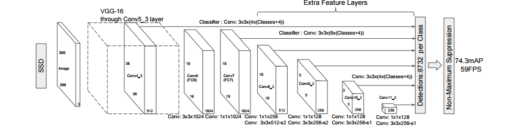
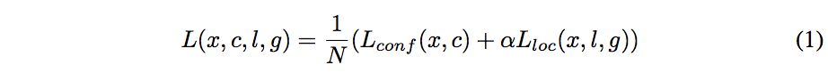
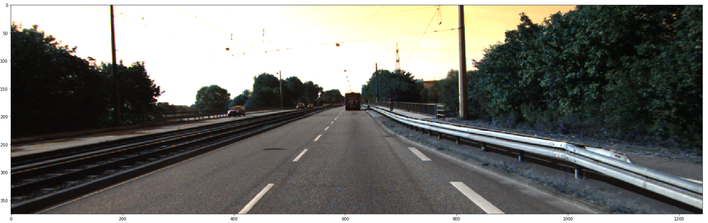
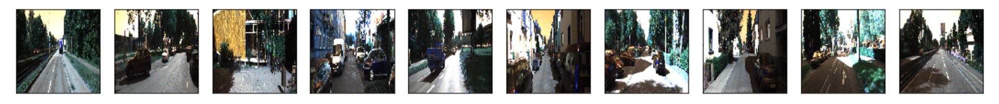

# kitti-object-detection
Eric Bai

05/31/2017

Single Shot MultiBox Detector for Autonomous Driving

## Introduction

The goal of this project is to understand different meth- ods for 2d-Object detection with kitti datasets. A few im- portant papers using deep convolutional networks have been published in the past few years. Fast R-CNN, Faster R- CNN, YOLO and SSD are the main methods for near real time object detection. R-CNN models are using Regional Proposals for anchor boxes with relatively accurate results. For this project, I will implement SSD detector. The goal is to achieve similar or better mAP with much faster train- ing/test time. The imput to our algorithm is frame of images from Kitti video datasets. We then use a SSD to output a predicted object class and bounding box. For simplicity, I will only make car predictions.

## Methods

(Single Short Detector) SSD is a relatively simple ap- proach without regional proposals. The first step is to re- size all images to 300x300 and use VGG-16 CNN to ex- tract feature maps. Then several feature layers help predict the offsets to default boxes of different scales and aspect ra- tios and their associated confidences. I havent finished the implementation of all the feature layers.  

  

SSD only needs an input image and ground truth boxes for each object during training. For each default box, the shape offsets and the confidences for all object categories ((c1, c2, , cp)) are predicted. At training time, we calculate the difference between these default boxes to the ground truth boxes. The model loss is a weighted sum between localization loss (e.g. Smooth L1 [6]) and confidence loss (e.g. Softmax).  

  

## Dataset

[Kitti object detection dataset](http://www.cvlibs.net/datasets/kitti/eval_object.php)
1. [Left color images of object data set](http://www.cvlibs.net/download.php?file=data_object_image_2.zip) (12 GB)
2. [Training labels of object data set](http://www.cvlibs.net/download.php?file=data_object_label_2.zip) (5 MB)
3. [Object development kit](http://kitti.is.tue.mpg.de/kitti/devkit_object.zip) (1 MB)  

The kitti object detection dataset consists of 7481 train- ing images and 7518 test images. All the images are color images saved as png. There are a total of 80,256 labeled objects. The labels include type of the object, whether the object is truncated, occluded (how visible is the object), 2D bounding box pixel coordinates (left, top, right, bottom) and score (confidence in detection). The image is not squared, so I need to resize the image to 300x300 in order to fit VGG- 16 first. Then the images are centered by mean of the train- ing images.
...
### Useful cmd

1.transfer files between workstation and gcloud
gcloud compute copy-files *.png project-cpu:/home/eric/project/kitti-ssd/kitti-object-detection/imgs
2. 
